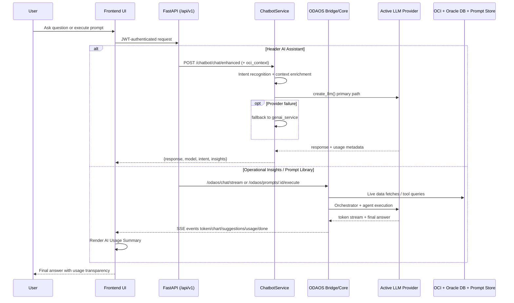
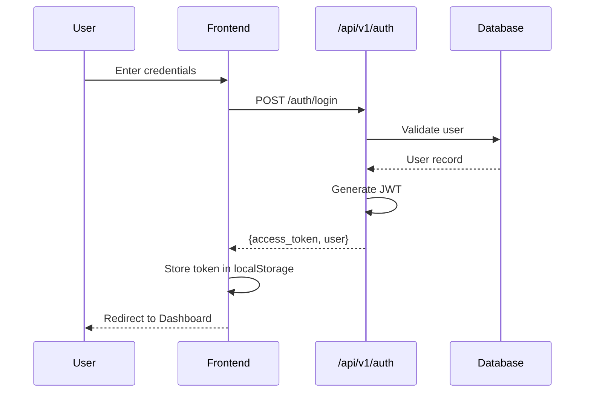
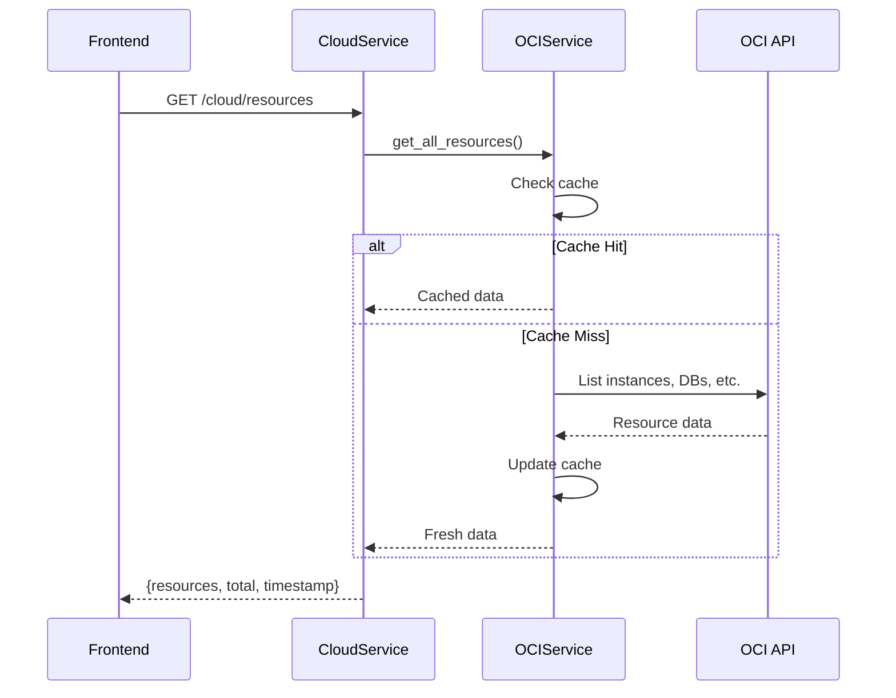
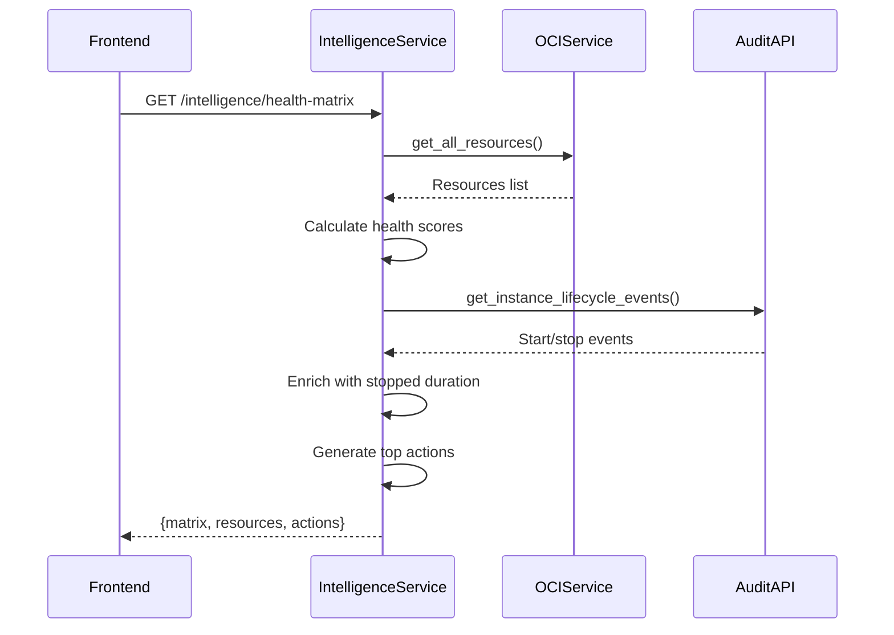
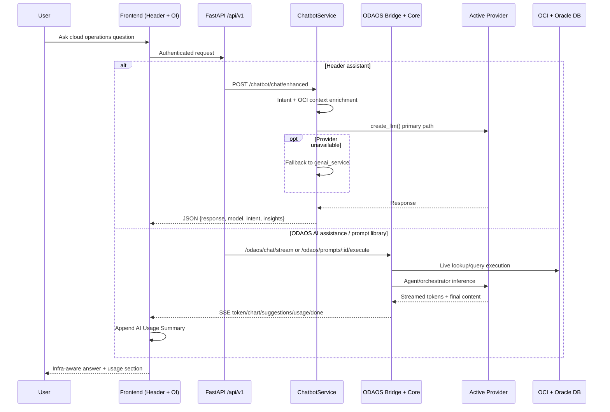
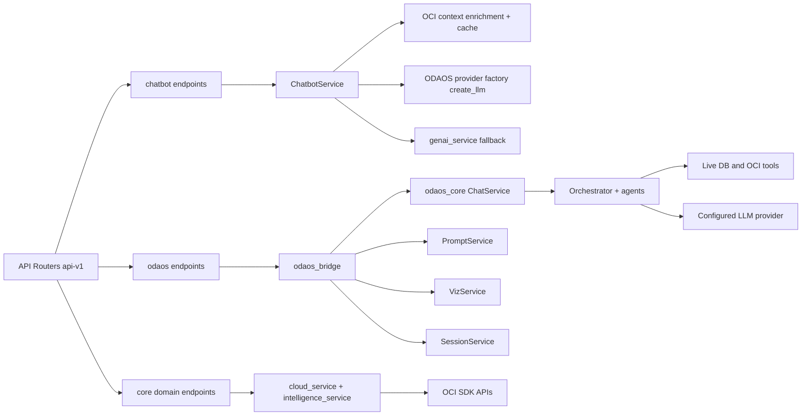

# 🚀 GenAI CloudOps Dashboard

[](https://opensource.org/licenses/MIT)
[](https://www.python.org/downloads/)
[](https://fastapi.tiangolo.com/)
[](https://reactjs.org/)
[](https://oracle-cloud-infrastructure-python-sdk.readthedocs.io/)
[](https://www.typescriptlang.org/)

**An intelligent, AI-powered cloud operations dashboard for Oracle Cloud Infrastructure (OCI) with advanced monitoring, automation, and conversational AI capabilities.**

---

## 📋 Table of Contents

- [Overview](#-overview)
- [AI Model Runtime & Fine-Tuning](#-ai-model-runtime--fine-tuning-updated-march-2026)
- [Architecture](#-architecture)
- [Technology Stack](#-technology-stack)
- [Project Structure](#-project-structure)
- [Execution Flow](#-execution-flow)
- [Frontend Layer](#-frontend-layer)
- [Backend Layer](#-backend-layer)
- [OCI API Integration](#-oci-api-integration)
- [Security & Authentication](#-security--authentication)
- [Quick Start](#-quick-start)
- [Configuration](#-configuration)
- [API Reference](#-api-reference)
- [Deployment](#-deployment)
- [Monitoring & Observability](#-monitoring--observability)

---

## 🌟 Overview

The GenAI CloudOps Dashboard is a comprehensive cloud operations management platform that combines **Generative AI**, **real-time monitoring**, **automated remediation**, and **intelligent analytics** to provide visibility and control over your OCI infrastructure.

### 🎯 Key Features

| Feature | Description |
|---------|-------------|
| 🤖 **AI-Powered Operations** | GenAI chatbot for natural language cloud management |
| 📊 **Cloud Intelligence Hub** | Health matrix, resource scoring, and actionable insights |
| 🔧 **Auto-Remediation** | AI-assessed automated fixes with approval workflows |
| 💰 **Cost Optimization** | Cost analysis, forecasting, and optimization recommendations |
| 🔐 **Security Analysis** | RBAC analysis, IAM policy evaluation, and security scoring |
| ☸️ **Kubernetes Management** | OKE cluster monitoring, pod health, and log analysis |
| 📈 **Real-time Dashboards** | Live metrics, charts, and status indicators |

---

## 🧠 AI Model Runtime & Fine-Tuning (Updated: March 2026)

This section reflects the current runtime behavior (not the older chatbot-only flow).

### Model Execution Paths

1. **Header AI Assistant (`/chatbot`)**
- Frontend: `ChatbotPanel.tsx` sends `POST /api/v1/chatbot/chat/enhanced`
- Backend: `chatbot_service.py`
- Primary model path: **ODAOS provider factory** (`app.odaos_core.core.providers.create_llm`)
- Fallback path: legacy `genai_service` if provider call fails
- Infra context: selected compartment/provider from UI is passed via `oci_context`

2. **Operational Insights AI Assistant + Prompt Library (`/operational-insights`)**
- Chat stream: `GET /api/v1/odaos/chat/stream`
- Prompt execution stream: `POST /api/v1/odaos/prompts/{prompt_id}/execute`
- Backend services: `app/odaos_core/api/services/chat_service.py` + ODAOS orchestrator
- These routes stream assistant output + usage telemetry

### Supported Model Providers (ODAOS)

Configured in `backend/app/odaos_core/core/config.py`:
- `groq`
- `openrouter`
- `ollama`
- `anthropic`
- `gemini`

Runtime selection is controlled by `ODAOS_LLM_PROVIDER` and provider-specific keys/models in `.env`.

### Fine-Tuning Details

There is **no custom weight fine-tuned model artifact** checked into this repository today.

Current adaptation strategy is runtime/domain tuning via:
- Intent recognition (infra/troubleshooting/cost/etc.)
- Prompt templates and structured system guidance
- Live OCI context enrichment (resources, alerts, compartment-aware context)
- Conversation/session context
- Prompt-library driven execution paths

### AI Usage Transparency (Current Behavior)

For ODAOS responses, the UI appends **AI Usage Summary** with:
- Input Tokens
- Output Tokens
- Total Tokens
- Estimated Energy Usage (Wh)
- Estimated CO2 Emissions (g)
- Response Time

If any metric cannot be produced by runtime/provider, UI shows `Not Available`.

---

## 🏗️ Architecture

### High-Level System Architecture

```mermaid
flowchart TB
    subgraph FE[Frontend (React + TypeScript)]
        DASH[Dashboard + Operations Modules]
        HEADER[Header AI Assistant<br/>ChatbotPanel]
        OI[Operational Insights<br/>AI Assistance + Prompt Library]
        API[API Clients<br/>Axios + fetch SSE + React Query]
        DASH --> API
        HEADER --> API
        OI --> API
    end

    API -->|REST + SSE + WS| GATE[FastAPI API Gateway<br/>api-v1 routes]

    subgraph BE[Backend Runtime]
        AUTH[Auth + RBAC<br/>auth routes]
        DOMAIN[Cloud + Intelligence + Monitoring<br/>Cost + K8s + Remediation]
        HCHAT[Header Assistant Path<br/>chatbot chat enhanced]
        OROUTES[ODAOS Path<br/>chat stream and prompt execute]
        BRIDGE[odaos_bridge + odaos_core services]
        PRIMARY[create_llm provider factory]
        FALLBACK[genai_service fallback]
    end

    GATE --> AUTH
    GATE --> DOMAIN
    GATE --> HCHAT
    GATE --> OROUTES
    HCHAT --> PRIMARY
    HCHAT --> FALLBACK
    OROUTES --> BRIDGE

    subgraph EXT[Data + External Systems]
        OCI[OCI APIs]
        BRMDB[Oracle BRM / DBA data sources]
        LLM[LLM Providers<br/>Groq/OpenRouter/Ollama/Anthropic/Gemini]
        STORE[Prompt store + app DB + cache]
    end

    DOMAIN --> OCI
    BRIDGE --> BRMDB
    PRIMARY --> LLM
    BRIDGE --> LLM
    AUTH --> STORE
    OROUTES --> STORE
```

### Request Lifecycle Flow



---

## 🛠️ Technology Stack

### Frontend
| Technology | Purpose |
|------------|---------|
| **React 18** | UI Framework with hooks and functional components |
| **TypeScript 5** | Type-safe JavaScript |
| **Vite** | Build tool and dev server |
| **React Query** | Server state management and caching |
| **React Router v6** | Client-side routing |
| **Axios** | HTTP client with interceptors |
| **TailwindCSS** | Utility-first CSS framework |
| **Recharts** | Chart components for data visualization |
| **Font Awesome** | Icon library |

### Backend
| Technology | Purpose |
|------------|---------|
| **Python 3.11+** | Core language |
| **FastAPI** | Async web framework with OpenAPI docs |
| **SQLAlchemy** | ORM for database operations |
| **SQLite/PostgreSQL** | Database (SQLite for dev, PostgreSQL for prod) |
| **OCI Python SDK** | Oracle Cloud Infrastructure integration |
| **Kubernetes Client** | K8s cluster management |
| **Pydantic v2** | Data validation and serialization |
| **JWT (PyJWT)** | Authentication tokens |
| **LLM Provider Layer** | ODAOS provider factory (OpenRouter/Groq/Ollama/Anthropic/Gemini) + fallback GenAI service |

### Infrastructure
| Technology | Purpose |
|------------|---------|
| **Docker** | Containerization |
| **Docker Compose** | Multi-container orchestration |
| **Terraform** | Infrastructure as Code |
| **Oracle Cloud Infrastructure** | Cloud platform |

---

## 📁 Project Structure

```
GenAICloudOps/
├── backend/                    # Python FastAPI Backend
│   ├── app/
│   │   ├── api/
│   │   │   ├── endpoints/     # API route handlers
│   │   │   │   ├── auth.py              # Authentication endpoints
│   │   │   │   ├── cloud.py             # Cloud resources API
│   │   │   │   ├── intelligence.py      # Intelligence Hub API
│   │   │   │   ├── chatbot.py           # AI Chatbot API
│   │   │   │   ├── kubernetes.py        # K8s management API
│   │   │   │   ├── monitoring.py        # Monitoring API
│   │   │   │   ├── cost_analyzer.py     # Cost analysis API
│   │   │   │   ├── access_analyzer.py   # Security analysis API
│   │   │   │   ├── remediation.py       # Auto-remediation API
│   │   │   │   ├── vault.py             # OCI Vault API
│   │   │   │   └── websocket.py         # Real-time WebSocket
│   │   │   └── router.py      # Main API router
│   │   ├── core/              # Core configuration
│   │   │   ├── config.py                # Application settings
│   │   │   ├── security.py              # JWT & authentication
│   │   │   ├── middleware.py            # Request middleware
│   │   │   └── exceptions.py            # Custom exceptions
│   │   ├── models/            # SQLAlchemy ORM models
│   │   │   └── user.py                  # User data model
│   │   ├── schemas/           # Pydantic schemas
│   │   │   ├── auth.py                  # Auth request/response
│   │   │   └── cloud.py                 # Cloud resource schemas
│   │   └── services/          # Business logic layer
│   │       ├── cloud_service.py         # OCI API integration
│   │       ├── intelligence_service.py  # Health matrix & scoring
│   │       ├── genai_service.py         # LLM integration
│   │       ├── chatbot_service.py       # AI chatbot logic
│   │       ├── monitoring_service.py    # Metrics collection
│   │       ├── cost_analyzer_service.py # Cost analysis
│   │       ├── kubernetes_service.py    # K8s operations
│   │       ├── cache_service.py         # Caching layer
│   │       └── auth_service.py          # User authentication
│   ├── main.py                # Application entry point
│   ├── requirements.txt       # Python dependencies
│   └── .env                   # Environment configuration
│
├── frontend/                  # React TypeScript Frontend
│   ├── src/
│   │   ├── components/
│   │   │   ├── pages/         # Page components
│   │   │   │   ├── DashboardPage.tsx          # Main dashboard
│   │   │   │   ├── CloudResourcesPage.tsx     # Resource browser
│   │   │   │   ├── IntelligenceHubPage.tsx    # Health matrix
│   │   │   │   ├── MonitoringPage.tsx         # Real-time monitoring
│   │   │   │   ├── CostAnalyzerPage.tsx       # Cost analysis
│   │   │   │   ├── AccessAnalyzerPage.tsx     # Security analysis
│   │   │   │   ├── PodHealthAnalyzerPage.tsx  # K8s pod health
│   │   │   │   ├── RemediationPage.tsx        # Auto-remediation
│   │   │   │   └── SettingsPage.tsx           # Configuration
│   │   │   ├── layout/        # Layout components
│   │   │   │   ├── Header.tsx           # Top navigation bar
│   │   │   │   ├── Sidebar.tsx          # Left navigation
│   │   │   │   └── ChatbotPanel.tsx     # AI chatbot panel
│   │   │   └── ui/            # Reusable UI components
│   │   ├── services/          # API service modules
│   │   │   ├── apiClient.ts             # Axios instance
│   │   │   ├── authService.ts           # Auth API calls
│   │   │   ├── cloudService.ts          # Cloud resource API
│   │   │   ├── intelligenceService.ts   # Intelligence API
│   │   │   ├── chatbotService.ts        # Chatbot API
│   │   │   └── kubernetesService.ts     # K8s API
│   │   ├── contexts/          # React contexts
│   │   │   ├── AuthContext.tsx          # Authentication state
│   │   │   ├── NotificationContext.tsx  # Notifications
│   │   │   └── ThemeContext.tsx         # Dark/light theme
│   │   ├── types/             # TypeScript type definitions
│   │   ├── App.tsx            # Main app component
│   │   └── main.tsx           # Application entry
│   ├── package.json           # Node dependencies
│   └── vite.config.ts         # Vite configuration
│
├── docs/                      # Documentation
├── deployment/                # Deployment configurations
│   └── helm-chart/            # Kubernetes Helm charts
├── infrastructure/            # Terraform IaC
├── docker-compose.yml         # Development containers
├── docker-compose.prod.yml    # Production containers
└── README.md                  # This file
```

---

## 🔄 Execution Flow

### 1. Authentication Flow



### 2. Cloud Resources Flow



### 3. Intelligence Hub Flow



### 4. AI Assistant Flow (Current)



---

## 💻 Frontend Layer

### Component Hierarchy

```
App.tsx
├── AuthContext (authentication state)
├── ThemeContext (dark/light mode)
├── NotificationContext (alerts/toasts)
└── Router
    ├── /login → LoginForm
    ├── /dashboard → DashboardPage
    │   ├── Header
    │   ├── Sidebar
    │   ├── StatCards
    │   └── Charts
    ├── /resources → CloudResourcesPage
    │   └── ResourceGrid
    ├── /intelligence → IntelligenceHubPage
    │   ├── TopActionsPanel
    │   ├── HealthMatrix
    │   └── ResourceList
    ├── /monitoring → MonitoringPage
    │   └── MetricsCharts
    ├── /cost → CostAnalyzerPage
    │   └── CostBreakdown
    └── /chatbot → ChatbotPanel
        ├── MessageList
        └── InputBox
```

### State Management

| Context | Purpose | Key Data |
|---------|---------|----------|
| **AuthContext** | User authentication | `user`, `token`, `isAuthenticated` |
| **ThemeContext** | UI theming | `theme`, `toggleTheme` |
| **NotificationContext** | Alert management | `notifications`, `unreadCount` |

### API Integration Pattern

```typescript
// services/intelligenceService.ts
export const useHealthMatrix = (compartmentId: string) => {
  return useQuery({
    queryKey: ['health-matrix', compartmentId],
    queryFn: () => getHealthMatrix(compartmentId),
    staleTime: 5 * 60 * 1000,  // 5 minute cache
    refetchOnWindowFocus: false
  });
};
```

---

## 🐍 Backend Layer

### Service Dependencies



### Key Services

| Service | File | Purpose |
|---------|------|---------|
| **OCIService** | `cloud_service.py` | OCI API integration, resource fetching |
| **IntelligenceService** | `intelligence_service.py` | Health scoring, matrix generation |
| **ChatbotService** | `chatbot_service.py` | Header assistant flow, intent recognition, OCI context enrichment |
| **ODAOSBridge** | `odaos_bridge.py` | Bridges `/api/v1/odaos/*` routes to migrated `app.odaos_core` services |
| **ODAOS ChatService** | `odaos_core/api/services/chat_service.py` | Streaming chat/prompt execution with usage metrics and visualization hooks |
| **GenAIService** | `genai_service.py` | Legacy/fallback LLM path when ODAOS provider call is unavailable |
| **MonitoringService** | `monitoring_service.py` | Metrics and alerts |
| **CostAnalyzerService** | `cost_analyzer_service.py` | Cost analysis and forecasting |
| **CacheService** | `cache_service.py` | File-based caching layer |
| **AuthService** | `auth_service.py` | User authentication and JWT |

### OCI API Clients (Lazy Initialized)

```python
# cloud_service.py
client_factories = {
    'compute': lambda: oci.core.ComputeClient(self.config),
    'identity': lambda: oci.identity.IdentityClient(self.config),
    'monitoring': lambda: oci.monitoring.MonitoringClient(self.config),
    'database': lambda: oci.database.DatabaseClient(self.config),
    'container_engine': lambda: oci.container_engine.ContainerEngineClient(self.config),
    'load_balancer': lambda: oci.load_balancer.LoadBalancerClient(self.config),
    'audit': lambda: oci.audit.AuditClient(self.config),
    'usage_api': lambda: oci.usage_api.UsageapiClient(self.config),
    # ... more clients
}
```

---

## ☁️ OCI API Integration

### Resources Collected

| Resource Type | OCI Service | Methods Used |
|--------------|-------------|--------------|
| **Compute Instances** | ComputeClient | `list_instances`, `get_instance` |
| **Databases** | DatabaseClient | `list_autonomous_databases`, `list_db_systems` |
| **OKE Clusters** | ContainerEngineClient | `list_clusters`, `list_node_pools` |
| **Load Balancers** | LoadBalancerClient | `list_load_balancers` |
| **Block Volumes** | BlockstorageClient | `list_volumes` |
| **VCNs & Subnets** | VirtualNetworkClient | `list_vcns`, `list_subnets` |
| **Audit Events** | AuditClient | `list_events` |
| **Compartments** | IdentityClient | `list_compartments` |

### Health Scoring Algorithm

```python
# intelligence_service.py
SCORING_RULES = {
    'state_stopped': -2,      # Stopped resource
    'state_terminated': -5,   # Terminated resource
    'state_error': -4,        # Error state
    'inactive_30_days': -1,   # Inactive 30+ days
    'inactive_90_days': -3,   # Inactive 90+ days
    'no_backup_policy': -2,   # Missing backups
    'low_cpu_utilization': -1 # < 5% CPU for 7 days
}
BASE_SCORE = 10  # All resources start at 10
```

---

## 🔐 Security & Authentication

### JWT Authentication Flow

```
┌─────────────────────────────────────────────────────────────────┐
│                    Authentication Flow                          │
│                                                                 │
│  1. User submits credentials                                   │
│     POST /api/v1/auth/login {username, password}               │
│                                                                 │
│  2. Backend validates & generates JWT                          │
│     • Verify password hash (bcrypt)                            │
│     • Create access_token (15 min expiry)                      │
│     • Create refresh_token (7 day expiry)                      │
│                                                                 │
│  3. Frontend stores token                                      │
│     localStorage.setItem('access_token', token)                │
│                                                                 │
│  4. Subsequent requests include token                          │
│     Authorization: Bearer <access_token>                       │
│                                                                 │
│  5. Backend validates on each request                          │
│     • Verify JWT signature                                     │
│     • Check expiration                                         │
│     • Extract user from token                                  │
└─────────────────────────────────────────────────────────────────┘
```

### Security Features

- **Password Hashing**: bcrypt with salt
- **JWT Tokens**: RS256 signed, configurable expiry
- **CORS**: Configured for frontend origin
- **Rate Limiting**: Request throttling middleware
- **Input Validation**: Pydantic schema validation
- **SQL Injection Protection**: SQLAlchemy ORM

---

## 🚀 Quick Start

### Prerequisites

- **Python 3.11+** with pip
- **Node.js 18+** with npm
- **OCI Account** with configured credentials
- **Docker** (optional, for containerized deployment)

### 1. Clone Repository

```bash
git clone https://github.com/Saket8/GenAICloudOps.git
cd GenAICloudOps
```

### 2. Backend Setup

```bash
cd backend

# Create virtual environment
python -m venv venv
venv\Scripts\activate  # Windows
# source venv/bin/activate  # Linux/Mac

# Install dependencies
pip install -r requirements.txt

# Configure environment
cp .env.example .env
# Edit .env with your OCI credentials

# Initialize database
python init_db.py

# Start server
python main.py
```

Backend runs at: `http://localhost:8000`

### 3. Frontend Setup

```bash
cd frontend

# Install dependencies
npm install

# Start development server
npm run dev
```

Frontend runs at: `http://localhost:3000`

### 4. Default Login

| Username | Password | Role |
|----------|----------|------|
| `admin` | `admin123` | Administrator |

---

## ⚙️ Configuration

### Environment Variables

```bash
# backend/.env

# Core Settings
ENVIRONMENT=development
SECRET_KEY=your-secret-key-here
DATABASE_URL=sqlite:///./genai_cloudops.db

# OCI Configuration
OCI_CONFIG_FILE=~/.oci/config
OCI_PROFILE=DEFAULT
OCI_REGION=us-ashburn-1
OCI_TENANCY_ID=ocid1.tenancy.oc1..xxx
OCI_COMPARTMENT_ID=ocid1.compartment.oc1..xxx

# GenAI (legacy fallback service)
GROQ_API_KEY=gsk_xxx
GROQ_MODEL=llama3-8b-8192

# ODAOS Provider Selection (primary model path)
ODAOS_LLM_PROVIDER=openrouter
OPENROUTER_API_KEY=sk-or-xxx
OPENROUTER_MODEL=deepseek/deepseek-chat

# Optional alternative providers
# ODAOS_LLM_PROVIDER=groq
# GROQ_MODEL=llama-3.3-70b-versatile
# ODAOS_LLM_PROVIDER=ollama
# OLLAMA_BASE_URL=http://localhost:11434
# OLLAMA_MODEL=qwen3-coder
# ODAOS_LLM_PROVIDER=anthropic
# ANTHROPIC_API_KEY=sk-ant-xxx
# ANTHROPIC_MODEL=claude-sonnet-4-20250514
# ODAOS_LLM_PROVIDER=gemini
# GOOGLE_API_KEY=xxx
# GEMINI_MODEL=gemini-2.0-flash

# Optional Features
USE_DUMMY_OCI=false
PROMETHEUS_ENABLED=false
NOTIFICATIONS_ENABLED=true
```

### OCI Authentication

Ensure `~/.oci/config` is configured:

```ini
[DEFAULT]
user=ocid1.user.oc1..xxx
fingerprint=xx:xx:xx:xx:xx
key_file=~/.oci/oci_api_key.pem
tenancy=ocid1.tenancy.oc1..xxx
region=us-ashburn-1
```

---

## 📡 API Reference

### Core Endpoints

| Method | Endpoint | Description |
|--------|----------|-------------|
| `POST` | `/api/v1/auth/login` | User authentication |
| `GET` | `/api/v1/cloud/resources` | List all OCI resources |
| `GET` | `/api/v1/cloud/compartments` | List compartments |
| `GET` | `/api/v1/intelligence/health-matrix` | Get health matrix |
| `GET` | `/api/v1/intelligence/top-actions` | Get recommended actions |
| `POST` | `/api/v1/chatbot/chat/enhanced` | Header AI assistant request |
| `GET` | `/api/v1/chatbot/suggestions` | Header assistant quick suggestions |
| `GET` | `/api/v1/odaos/chat/stream` | ODAOS AI Assistant SSE stream |
| `POST` | `/api/v1/odaos/prompts/{prompt_id}/execute` | Prompt Library execution SSE stream |
| `GET` | `/api/v1/odaos/prompts` | Prompt Library catalog |
| `GET` | `/api/v1/kubernetes/pods` | List K8s pods |
| `GET` | `/api/v1/cost/analysis` | Cost breakdown |

### API Documentation

Interactive docs available at:
- Swagger UI: `http://localhost:8000/docs`
- ReDoc: `http://localhost:8000/redoc`

---

## 🐳 Deployment

### Docker Compose (Development)

```bash
docker-compose up -d

# View logs
docker-compose logs -f

# Stop
docker-compose down
```

### Docker Compose (Production)

```bash
docker-compose -f docker-compose.prod.yml up -d
```

### Kubernetes (Helm)

```bash
cd deployment/helm-chart
helm install genai-cloudops . -f values-prod.yaml
```

---

## 📊 Monitoring & Observability

### Health Check Endpoints

| Endpoint | Purpose |
|----------|---------|
| `GET /api/v1/health` | Application health |
| `GET /api/v1/health/database` | Database connectivity |

### Application Metrics

- **Request latency**: p50, p95, p99
- **Error rates**: By endpoint and status code
- **Cache hit rates**: OCI data cache performance
- **GenAI metrics**: Token usage and response times

### Logging

Logs output to stdout in JSON format:
```json
{
  "timestamp": "2024-12-15T10:00:00Z",
  "level": "INFO",
  "service": "intelligence_service",
  "message": "Health matrix computed",
  "resources": 40,
  "healthy": 32
}
```

---

## 🗺️ Roadmap

### Current: v1.0.0 ✅
- Core monitoring and alerting
- GenAI chatbot integration
- Cloud Intelligence Hub
- Cost analysis and optimization

### Planned: v1.1.0
- 🔮 Multi-cloud support (AWS, Azure)
- 🔮 Advanced ML anomaly detection
- 🔮 Mobile application

---

## 🆘 Support

- **📖 Documentation**: [docs/](docs/)
- **🐛 Issues**: [GitHub Issues](https://github.com/your-org/GenAICloudOps/issues)
- **💬 Discussions**: [GitHub Discussions](https://github.com/your-org/GenAICloudOps/discussions)

---

## 📄 License

MIT License - see [LICENSE](LICENSE)

---

**Made with ❤️ by the GenAI CloudOps Team**

*Empowering cloud operations with artificial intelligence*
